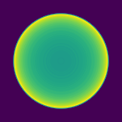
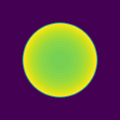

# Optical simulation
Ray tracing from an on-axis point source through a BK7 biconvex lens to a sensor using `numpy`.

Contents:
- [Quick Overview](#overview)
- [Questions](#qualitative-questions)
- [Tracing Diagram](#tracing-diagram)

## Overview
`tracer.py` contains the code to perform the tracing\
`run_sweeps.py` contains some loops to generate figures that help answer qualitative questions\
[`Diagram.pdf`](./Diagram.pdf) has diagrams that were useful for keeping track of the computations (embedded later)

The remainder of this document covers the qualitative concerns about the resultant PSF for the lens and my answers.

## Qualitative questions:
1) Looking at the resulting PSFs generated by this lens at various distances and lens parameters, what type of aberrations do you see?
1) How does sampling of the rays affect the result?
1) What would happen if the point source is off-axis?
1) What is the effect of varying lambda?
1) Which of these do you think are correctable with algorithms? What are the limitations? What are the pros and cons of using a NN approach vs a classical deconvolution filtering approach?

**Answers**  
1) Some of the typical "spherical" behavior, where we see a ring around the outside when inside the focus distance and central peak with fuzziness when outside the focus distance. Varying the sensor distance through the focus distance (coarse, fine):\
 \
(We see similar behavior when we vary D2)
1) Low sampling produces incorrect banding where parts of the image sensor undersampled and missed. Varying the number of samples from 15 to 5001 (logarithmically):\

1) The point source being off-axis would shift the peak of the psf in the opposite direction and stretch the shape in the aixs of the movement
1) Varying lambda changes the effective index of refraction, and so changes the distance at which the optimal focus occurs (or alternatively, at a fixed unfocused distance, changes the effective size of the psf). Varying lambda from 400nm to 700nm at fixed distance:\

1) All of these could be addressed algorithmically to some degree, since we know some high-level trends about their behavior. Spherical might be more difficult to handle than chromatic, since we have properties of the lens material but not depth information of the scene. Another limitation is on how much high frequency information in total is lost due to the blurring effect. A lower order limitation revolves around how well simulations (or empirical measurements of the same properties) match with reality and are affected by noise (especially in low light settings). A NN approach would allow a lot of the non-stationarity (such as how the PSF might change as the source moves off-axis) to be handled automatically, and can regularize using priors extracted from data acquired in real settings, while a deconvolution typically needs to regularize according to a heuristic designed by hand to remain numerically stable.

## Tracing Diagram
<object data="./Diagram.pdf" type="application/pdf" width="700px" height="700px">
    <embed src="./Diagram.pdf">
        
This browser does not support PDFs. Please download the PDF to view it: <a href="./Diagram.pdf">Download PDF</a>.

    </embed>
</object>